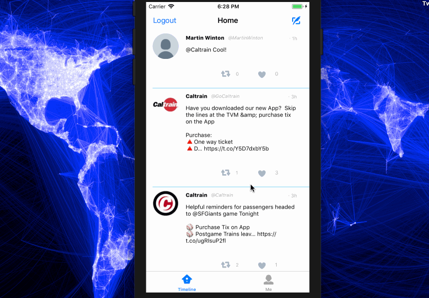
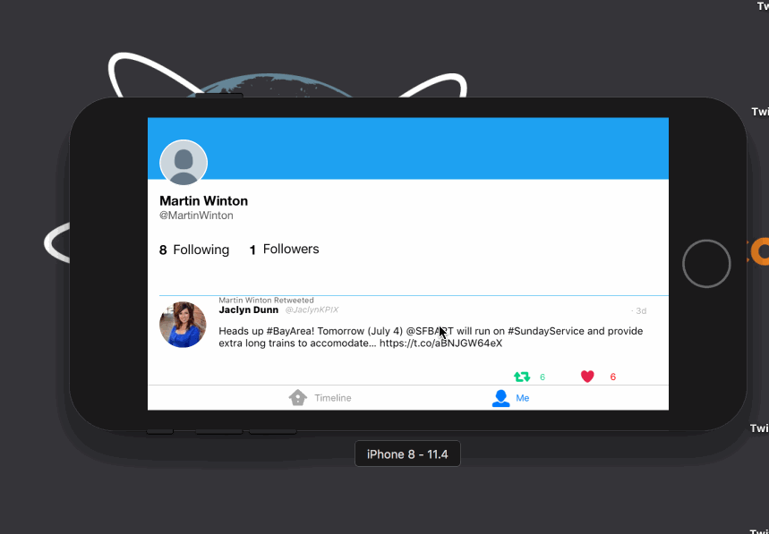
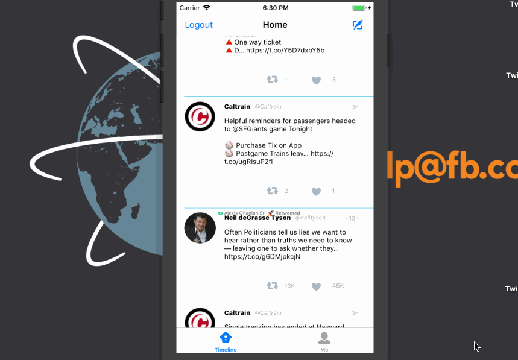
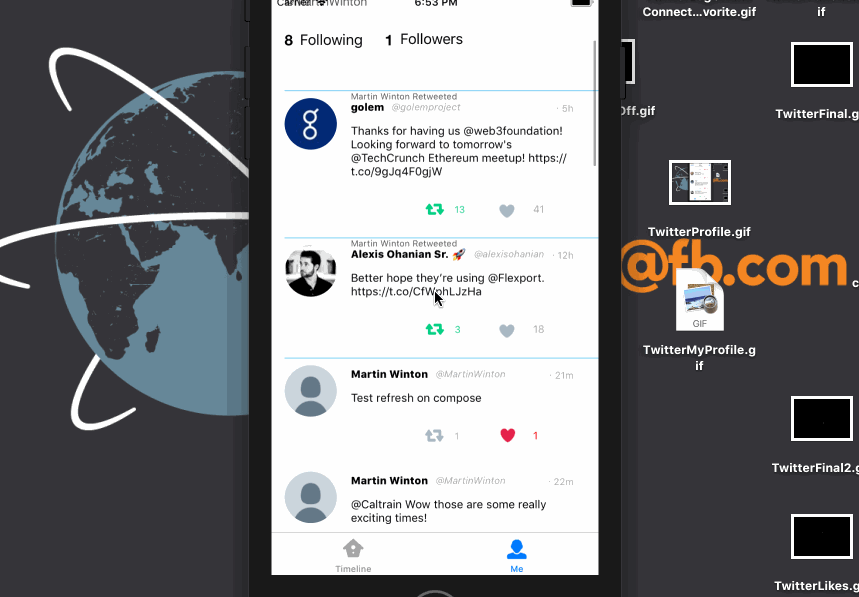
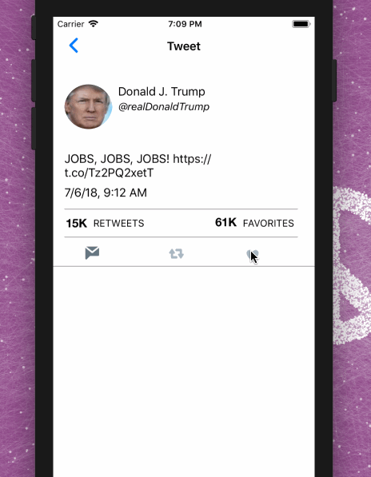

# Project 4 - *Twitte*r

**Twitter** is a basic twitter app to read and compose tweets the [Twitter API](https://apps.twitter.com/).

Time spent: **27** hours spent in total

## User Stories

The following **required** functionality is completed:

- [x] User sees app icon in home screen and styled launch screen
- [x] User can sign in using OAuth login flow
- [x] User can Logout
- [x] User can view last 20 tweets from their home timeline
- [x] In the home timeline, user can view tweet with the user profile picture, username, tweet text, and timestamp.
- [x] User can pull to refresh.
- [x] User can tap the retweet and favorite buttons in a tweet cell to retweet and/or favorite a tweet.
- [x] User can compose a new tweet by tapping on a compose button.
- [x] Using AutoLayout, the Tweet cell should adjust it's layout for iPhone 7, Plus and SE device sizes as well as accommodate device rotation.
- [x] The current signed in user will be persisted across restarts

The following **optional** features are implemented:

- [x] Tweet Details Page: User can tap on a tweet to view it, with controls to retweet, favorite, and reply.
 (reply not implemented)
- [x] User can view their profile in a *profile tab*
- Contains the user header view: picture and tagline
- Contains a section with the users basic stats: # tweets, # following, # followers
- [x] Profile view should include that user's timeline
- [x] User should display the relative timestamp for each tweet "8m", "7h"
- [x] User should be able to unretweet and unfavorite and should decrement the retweet and favorite count. Refer to [[this guide|unretweeting]] for help on implementing unretweeting.
- [ ] Links in tweets are clickable.
- [x] User can tap the profile image in any tweet to see another user's profile
- Contains the user header view: picture and tagline
- Contains a section with the users basic stats: # tweets, # following, # followers
- [x] User can load more tweets once they reach the bottom of the feed using infinite loading similar to the actual Twitter client.
- [x] When composing, you should have a countdown for the number of characters remaining for the tweet (out of 140) (**1 point**)
- [x] After creating a new tweet, a user should be able to view it in the timeline immediately without refetching the timeline from the network.
- [ x] User can reply to any tweet, and replies should be prefixed with the username and the reply_id should be set when posting the tweet (**2 points**)
- [x] User sees embedded images in tweet if available (in timeline view)
- [ ] User can switch between timeline, mentions, or profile view through a tab bar (**3 points**)
- [ ] Profile Page: pulling down the profile page should blur and resize the header image. (**4 points**)

The following **additional** features are implemented:

- [x] When favoriting or retweeting tweets, optimistic selection is implemented. For example, when favoriting on a bad connection, the favorte icon and counter update, but switch back if the POST request is not fufilled.
- [x] Similar to the twitter app, countdown changes to yellow if 20 and below and red if 0 and below. Allows users to reach negative number. However, when a red number is reached, Twitter button turns gray and users cannot tweet
- [x] When favoriting on retweeting on a tweet details page, the timeline page is automatically updated upon return
- [x] Detail tweet view displays exact time tweet was tweeted
- [x] If user is verified, a verified symbol is shown on their profile page
- [x] User header and feed are seperate cells allowing for smooth scrolling similar to actual Twitter app
- [x] # followers, retweets favs, etc are shortened using when in thousands
- [x] Profile pics are medium quality for optimal choice between loading and clarity
- [x] On timelines and users' profile pages retweets by the user are shown
- [x] Users can tap on profiles and tweet details on any profile page
- [x] Tweets with media align with autolayout

Please list two areas of the assignment you'd like to **discuss further with your peers** during the next class (examples include better ways to implement something, how to extend your app in certain ways, etc):

1.
2.

## Video Walkthrough

Here's a walkthrough of infinite scrolling, refreshing and overall app functionality

Here's a walkthrough of  all the autolayout views

Here's a walkthrough of implemented user stories:

Here's a walkthrough of composing and replying

Here's a walkthrough of implemented user stories:

Here's a walkthrough of the profile tab.

Here's a walkthrough of like and retweets, including likes resetting if twitter api does not accept like for any reason

GIF created with [LiceCap](http://www.cockos.com/licecap/).

## Notes

Describe any challenges encountered while building the app.

## Credits

List an 3rd party libraries, icons, graphics, or other assets you used in your app.

- [AFNetworking](https://github.com/AFNetworking/AFNetworking) - networking task library

## License

Copyright [yyyy] [name of copyright owner]

Licensed under the Apache License, Version 2.0 (the "License");
you may not use this file except in compliance with the License.
You may obtain a copy of the License at

http://www.apache.org/licenses/LICENSE-2.0

Unless required by applicable law or agreed to in writing, software
distributed under the License is distributed on an "AS IS" BASIS,
WITHOUT WARRANTIES OR CONDITIONS OF ANY KIND, either express or implied.
See the License for the specific language governing permissions and
limitations under the License.
